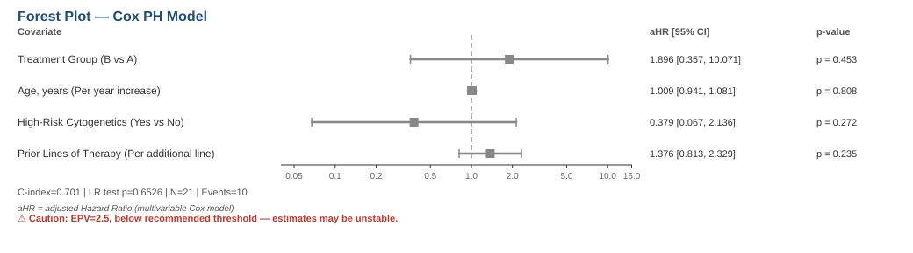

# Retrospective Clinical Research Tool

Local-first CLI and Web application that takes raw retrospective clinical study data to a STROBE-compliant manuscript draft. Built around a provenance-first, outcome-masking workflow to prevent HARKing and p-hacking.

## Setup & Installation

Install from PyPI:
```bash
pip install research-tool-cli
```

Or install locally in editable mode:
```bash
pip install -e .
```

For development and tests, install the project environment with its dev dependencies and run pytest through that interpreter:

```bash
uv sync --dev
.venv/bin/python -m pytest
```

This keeps pytest on the same Python environment as scipy, pandas, and tableone.

## Usage (CLI)

```bash
# ── Phase 1: Pre-Unmasking Protocol Specification ──────────────────────────
# 1. Create study
research-tool new-study "EMD Study"

# 2. Ingest CSV data
research-tool ingest <STUDY_ID> ./synthetic_21_v2.csv

# 3. Classify variables (masks outcome variables)
research-tool classify-variables <STUDY_ID>

# 4. Explore baseline data (outcomes masked)
research-tool explore-baseline <STUDY_ID>

# 5. Declare study plan
research-tool plan <STUDY_ID> --type cohort --comparison "PFS by treatment arm" --outcome-var-ids "8,9" --test "8:kaplan_meier_logrank:KM PFS comparison" --cox-ph-models "pfs_multivariable:pfs_days:pfs_event:treatment_arm:age,high_risk_fish,prior_lines:Adjusted PFS model"

# 6. Lock study plan
research-tool lock <STUDY_ID>

# ── Phase 2: Data Unmasking & Execution ──────────────────────────────────
# 7. Unmask outcome data
research-tool unmask <STUDY_ID>

# 8. Run analyses
research-tool analyze <STUDY_ID> --force

# ── Phase 3: Visualizations & Tables ──────────────────────────────────────
# 9. Table 1 (baseline characteristics)
research-tool table1 <STUDY_ID>

# 10. Kaplan-Meier plot (requires test_id, e.g. 1)
research-tool plot-km <STUDY_ID> 1

# 11. Forest plot (SVG & ASCII)
research-tool plot-forest <STUDY_ID>
research-tool plot-forest <STUDY_ID> --ascii

# 12. CONSORT flowchart
research-tool flowchart <STUDY_ID>

# ── Phase 4: Compliance & Reporting ───────────────────────────────────────
# 13. STROBE checklist audit
research-tool strobe-check <STUDY_ID>

# 14. Manuscript draft
research-tool draft <STUDY_ID>

# 15. Provenance lineage DAG
research-tool lineage <STUDY_ID>

# 16. Data forensics
research-tool forensics <STUDY_ID>

# 17. Reviewer JSON export
research-tool export <STUDY_ID>

# ── Phase 5: Bundling, Excel Export & Verification ───────────────────────
# 18. Create hash-verified bundle archive (generates manifest & composite SHA-256)
research-tool bundle <STUDY_ID>

# 19. Export Excel report (reads bundle manifest & populates composite hash on Tab 4)
research-tool export-excel <STUDY_ID>

# 20. Verify bundle integrity
research-tool verify-bundle data/studies/<STUDY_ID>/<STUDY_ID>_bundle.tar.gz
```

> **Note:** Variable IDs are auto-assigned per-study at ingest time and are **not predictable**. Always run `list-variables` after `classify-variables` to get the correct IDs for `--outcome-var-ids`.

See `research-tool --help` and `app/README.md` for web interface instructions.

---

## Sample Output

The following is real output from a complete run against the bundled `synthetic_21_v2.csv` fixture (21 subjects, 11 variables, PFS as the primary outcome). All files below are generated by the tool; nothing is hand-written.

### Forest plot (Cox PH model, `plot-forest`)



The same plot in ASCII (`plot-forest --ascii`):

```
Forest Plot — Cox PH Model

Covariate                                     │                                    aHR [95% CI]         p-value
                                              |───┬───┬────┬───┬──┬────┬───┬
                                              │   0.1 0.2  0.5 1  2    5   10
────────────────────────────────────────────────────────────────────────────────────────────────────────────────
Treatment Group (B vs A)                      │          ──────│──◇─────────      1.90 [  0.36,  10.07] p=0.453 (n.s.)
Age, years (Per year increase)                │               ─│                  1.01 [  0.94,   1.08] p=0.808 (n.s.)
High-Risk Cytogenetics (Yes vs No)            │ ─────────◇─────│────              0.38 [  0.07,   2.14] p=0.272 (n.s.)
Prior Lines of Therapy (Per additional line)  │              ──│◇───              1.38 [  0.81,   2.33] p=0.235 (n.s.)

C-index=0.701 | LR test p=0.6526 | N=21 | Events=10
aHR = adjusted Hazard Ratio (multivariable Cox model)
⚠ Caution: EPV=2.5, below recommended threshold — estimates may be unstable.
```

### Table 1 (baseline characteristics, `table1`)

```
                           Grouped by treatment_arm
                                            Missing      Overall            A            B
n                                                             21           10           11
age, mean (SD)                                    0  66.4 (14.2)  65.4 (16.9)  67.4 (12.1)
prior_lines, mean (SD)                            0    2.2 (1.4)    2.1 (1.4)    2.3 (1.5)
high_risk_fish, n (%)  no                              12 (57.1)     6 (60.0)     6 (54.5)
                       yes                              9 (42.9)     4 (40.0)     5 (45.5)
iss_stage, n (%)       I                                7 (33.3)     2 (20.0)     5 (45.5)
                       II                               8 (38.1)     5 (50.0)     3 (27.3)
                       III                              6 (28.6)     3 (30.0)     3 (27.3)
sex, n (%)             F                                7 (33.3)     3 (30.0)     4 (36.4)
                       M                               14 (66.7)     7 (70.0)     7 (63.6)
```

### STROBE checklist audit (`strobe-check`)

```
STROBE Compliance Report — Study: e996f439670948d286d362b0ad11357b
  Satisfied: 33/33 applicable items

  [✓] Item 1a: Study type recorded: cohort
  [✓] Item 3: 1 locked plan(s) found
  [✓] Item 5: Setting and dates tracked via created_at and data_dir
  [✓] Item 7: 11 variables classified
  [✓] Item 12a: 2 analyses recorded
  [✓] Item 12b: No post-unmask diagnostic violations detected across analyses
  [✓] Item 14a: 6 baseline variables
  [✓] Item 14b: Missing data displayed in Table 1 output
  [✓] Item 15: 5 outcome variable(s) tracked for event rates
  [✓] Item 16a: 2 analyses with estimates
  [✓] Item 22: Funding statement present
```

---

## Why this instead of [R package]?

If you already know R, the closest equivalents to this tool's pieces are **`tableone`** (Table 1), **`survival`** (Cox PH), and **`forestplot`** (the figure above). This tool does **not** replace their statistics — the Cox model here is a regular multivariable fit, the log-rank test is standard, and the Table 1 summary is the same tableone-style output (in fact, `tableone` is a direct Python dependency of this project, used for Table 1 generation — see the dev-setup line above).

What this tool adds is *provenance enforcement* around those stats, not better stats:

- **Outcome masking before protocol lock** — you must classify variables and declare/lock a study plan while outcome values are still hidden, so hypotheses can't be chosen by peeking at results.
- **Diagnostic gates that block execution** — post-unmask analyses run through checks (separation, multicollinearity, proportional-hazards) that can fail a run rather than silently emit unstable estimates, as the EPV warning in the sample output above shows.
- **A cryptographic audit chain** — every step (ingest hash, locked plan hash, execution fingerprint, bundle manifest with composite SHA-256) links into a tamper-evident lineage that a reviewer can verify end-to-end.

Run the same `survival`/`tableone`/`forestplot` pipeline in R and you get the numbers; run it here and you get the numbers **plus** proof they weren't post-hoc.

---

## Authors & Acknowledgments

## Authors & Acknowledgments

- **Lead Maintainer**: [Manjunath N K](https://github.com/nkmanjunath)
- **AI Pair Programming & Collaboration**:
  - **Google Antigravity (AGY)** — Pair Programming, 4-Gate Diagnostics & UI/UX design.
  - **OpenCode** — Statistical engine verification & benchmarking fixtures.
